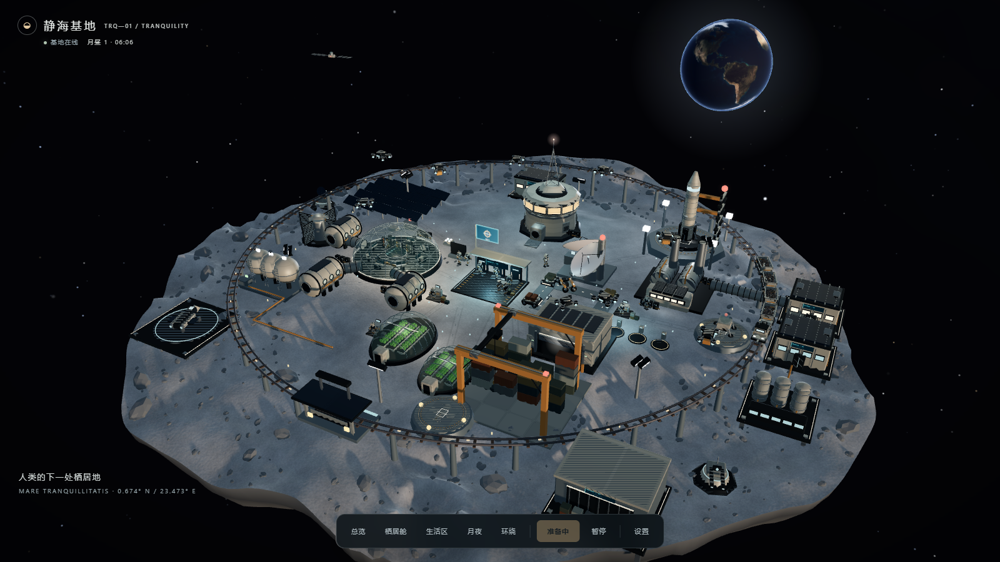
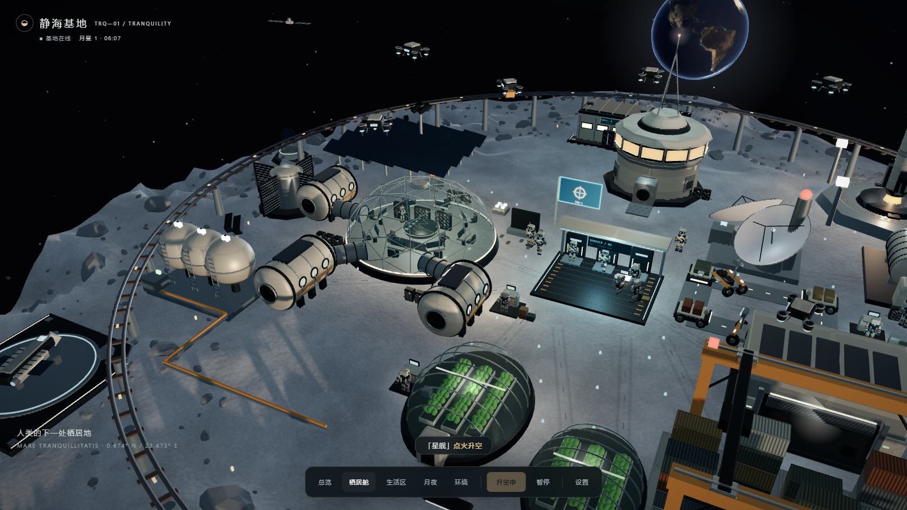
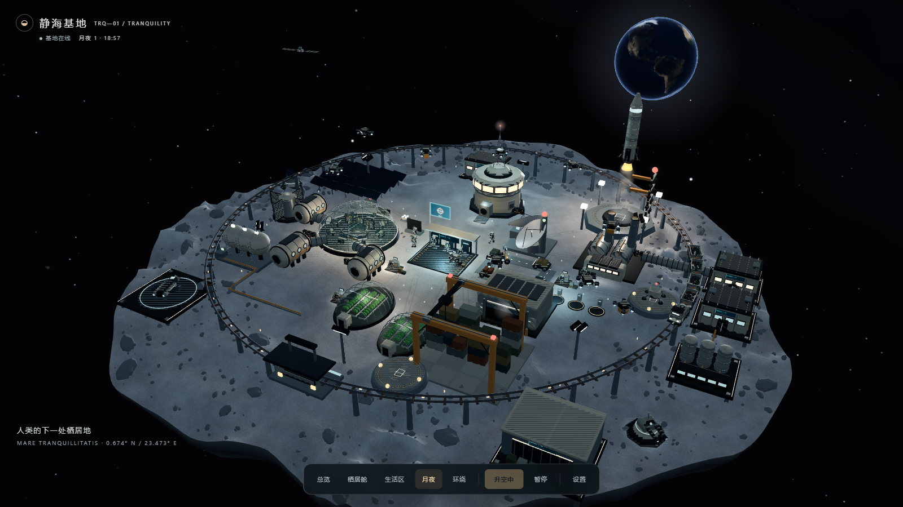

# 静海基地 TRQ-1

一个可直接打开的 Three.js 月面基地模拟场景：机器人聚落、矿车物流、无人机巡检、科研与医疗扩建、轨道飞船和自动发射循环。

## 在线体验

公网入口：

- [GitHub Pages 网站（推荐，直接打开）](https://nsdkoo.github.io/moon-base/)
- [稳定 CDN 备用（固定 commit，长期不变）](https://cdn.jsdelivr.net/gh/nsdkoo/moon-base@3f5c032/index.html)
- [最新 CDN 备用（跟随 main）](https://cdn.jsdelivr.net/gh/nsdkoo/moon-base@main/index.html)

GitHub Pages 是完整的公网网站入口，输入网址即可打开。jsDelivr 作为静态备用入口：固定 commit 地址适合长期分享，`main` 地址会跟随代码更新。

## 运行截图

双击 `index.html` 即可运行。Three.js、场景代码和地球纹理均已内嵌，成品无需联网或安装依赖。

## 场景

- 不规则月面、陨石坑、车辙、碎石与岩层断面。
- 十二面观测窗指挥舱、三角网格穹顶、带舷窗的加压舱和连接廊道。
- 穹顶内的控制台、座椅与仪表；透明温室内的种植床和补光灯。
- 资源处理罐、分离塔、散热器、低温储罐、维护车库与货运起重机。
- 真实地球影像纹理、星空、轨道器、灯光柔光和金属环境反射。
- 原创 TRQ-1 任务旗。设施标签默认关闭，在底部「设置 → 设施标签」中开启。
- 15 台关节机器人：舱内值班、充电、维修、交流与步行；10 架喷口式无人机巡检、运货和停靠，4 辆自动补给车到站减速。
- 充电港、维修台、工具、补给箱、舱内储物架与休息座椅；通行灯带、暖色舷窗、冷色设备灯和间歇焊接光。
- 默认开启缓慢昼夜循环和基地自运行：跳跃器运输、火箭发射返航、短程货船出港与间歇流星自动循环。自动调度不改变镜头；标签仍默认关闭。
- 加载后立即进入点火程序，返航着陆后等待 8 秒进入下一轮。外围舰船沿独立椭圆航线持续绕行，船头沿飞行方向，航线距基地中心至少 234 场景单位。
- 扩建科研实验室、医疗舱、轮班生活中心、水循环生命保障站、重型维修库与货运空港；加压廊道和管路连接相关设施。
- 轨道补给舰、巡逻舰、中继站与两处旋转警戒阵列补充外围活动。矿车具有轮组、联轴器、散热器、加强筋与实例化碎矿颗粒。
- 充电机器人定时离站再返回，步行路线避开充电平台；列车到站服务一次后正常离站。

这是可交互的月面营地微缩场景，采用艺术化构图与时间比例。

## 操作

- 拖拽环绕，右键或 Shift + 拖拽平移，滚轮缩放，双击复位。
- 底部「总览 / 栖居舱 / 月夜 / 环绕」控制观看方式；「发射」启动倒计时和飞行。
- 「设置」包含标签、灯光、昼夜循环、速度、运输、巡逻、月尘、阴影与音效。
- 「设置 → 矿运近景 / 扩建区」直达新细节；「基地自运行」控制自动派发任务，点击货运空港可手动呼叫短程货船。
- 点击设施查看详情或触发动作；点击移动实体进入跟随视角。
- 空格暂停；数字键 1–9、0 切换机位；B 标签，L 灯光，G 发射，R 复位。

## 开发与预览

- `app.js`：模拟、相机、交互和通用场景组件。
- `scene-design.js`：精细建筑、地形、材质、灯光与渲染管线。
- `colony-life.js`：机器人、无人机、物流车与聚落日常活动。
- `ecology.js`：矿车重建、功能扩建、轨道交通与循环任务调度。
- `template.html`：界面与内嵌脚本模板。
- `assets/earth-day.jpg`：打包时内嵌的地球纹理，来源见 `assets/README.md`。
- `python build.py`：生成单文件 `index.html`。
- `python preview.py`：启动仅提供当前成品页面的本机 HTTP 服务，终端输出随机分配的预览地址。
- `shots/colony-overview.png`、`shots/colony-life.png`：机器人聚落版本的总览与生活区运行实拍。

旧体素版本保留在 `app-voxel.js` 与 `index-voxel.html`。
